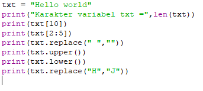
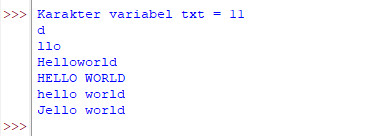

# Praktikum 10

#### txt = 'Hello World'
#### • Hitung jumlah karakternya
#### • Ambil karakter terakhir
#### • Ambil karakter index ke-2 sampai index ke-4 (llo)
#### • Hilangkan spasi pada text tersebut (HelloWorld)
#### • Ubah text menjadi huruf besar
#### • Ubah text menjadi huruf kecil
#### • Ganti karakter H dengan karakter J

## Code

## Output

